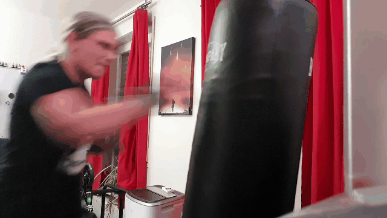
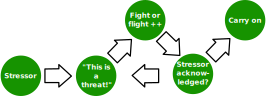
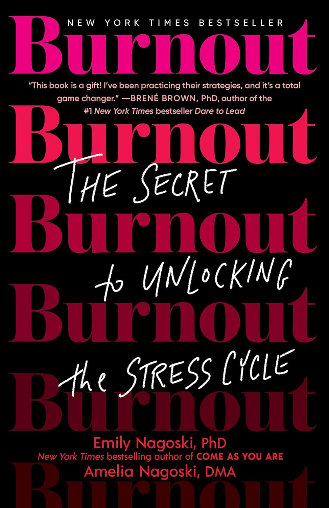
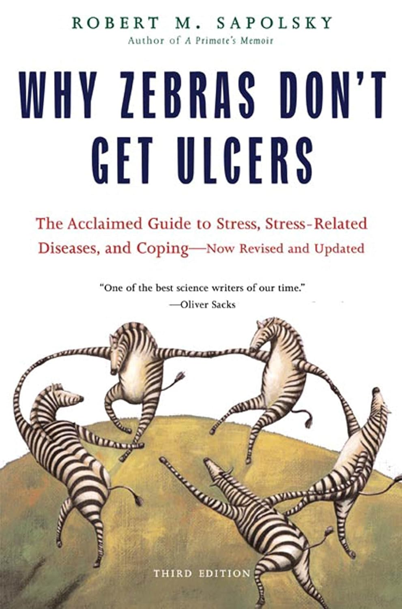

<!-- .element: class="layout-center" -->

# How to deal with toxic people

Gina Häußge // [foosel.net](https://foosel.net)

    EuroPython 2025

--- 

<!-- .element: class="layout-half" data-background-image="img/me.jpg" data-background-size="49%" data-background-position="right" -->

## Gina Häußge

- 42 years old
- Software engineer
- Maker & boulderer
- PSF Fellow & GitHub Star
- 100% Nerd
- Creator & full-time maintainer of [OctoPrint](https://octoprint.org)

Notes:

- over 12 years of being a maintainer
- plenty of bad experiences with toxic people & their bad behaviour

---

<!-- .element: class="layout-full-cover-dark" data-background-image="img/toxic-behaviour.jpg" data-background-size="cover" -->

## What kind of bad behaviour?

(Trigger warning)

---

### Entitlement

> Why isn't this obscure feature implemented already that I need for my work?

> How rude of you to refuse to implement something I require!

> Wow, this bug is still open six months later? Get off your lazy 🤬 and fix it already!

---

### Frustration

> This crap just cost me thousands of dollars, 🤬 you for ever releasing this!

> WELL THANKS FOR NOTHING!

> I just updated and nothing works anymore, THIS IS THE LAST TIME I UPDATE!

---

### Attacks

> 🤬 YOU!!!

> LOL, you clearly SUCK as a dev! 🤬 off!

> Whoever designed this steaming pile of 🤬 should be shot!

---

<!-- .element: class="layout-full-cover-dark" data-background-image="img/coping-strategies.jpg" data-background-size="cover" -->

## Coping strategies

---

<!-- .element: class="layout-center" -->

### First:  Let off some steam!

---

<!-- .element: class="layout-half" data-background-image="img/zen.jpg" data-background-size="49%" data-background-position="right" -->

### Disengage & cool down

- Don't answer hot-headed
- Run through your **stress response**
- Only then respond

---

<!-- .element: class="layout-center" -->

### Stress response?

--- 

<!-- .element: class="layout-half" data-background-image="img/realities.jpg" data-background-size="49%" data-background-position="right" -->

### Remind of realities

- Open Source = no demands
- **collaboration & cooperation**
- Not just code, everything helps!
- "Patches welcome" 👎

---

<!-- .element: class="layout-half" data-background-image="img/boundaries.jpg" data-background-size="49%" data-background-position="right" -->

### Remind of boundaries

- You deserve **respect & decency**
- Make overstepping clear
- Enforce community rules (CoC)
- ["The Social Contract of Open Source"](https://snarky.ca/the-social-contract-of-open-source) (Brett Cannon)

---

<!-- .element: class="layout-half" data-background-image="img/additional-measures.jpg" data-background-size="49%" data-background-position="right" -->

### Additional measures

- De-prioritize issue
- Point the abuser to the door
- Ban hammer (last resort!)
- **Don't accept abuse!**

---

<!-- .element: class="layout-half" data-background-image="img/community.jpg" data-background-size="49%" data-background-position="right" -->

### How the community can help

- "This is just like it is in Open Source!" 👎
- Call out bad behaviour!
- **Always remember the human**

---

<!-- .element: class="layout-center" -->

## Further reading

**Burnout** 
Emily & Amelia Nagoski

**Why Zebras Don't Get Ulcers** 
Robert M. Sapolsky

---

<!-- .element: class="layout-half" data-background-image="img/qrcode.png" data-background-size="49%" data-background-position="right" -->

## Thank you for your attention!

🌐 [foosel.net](https://foosel.net)

🦣 [@foosel@chaos.social](https://chaos.social/@foosel)

🦋 [@foosel.net](https://bsky.app/profile/foosel.net)

    Image credits: @wesleyphotography, @dre0316, @seanstratton, @mvdheuvel, @freegraphictoday, @jodaarba, @sheldonkeenedy & @hannahbushing on Unsplash. Huge thanks for sharing!

