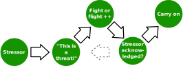

<!-- .element: class="layout-center" -->

# How to deal with toxic people

Gina Häußge // [foosel.net](https://foosel.net)

    EuroPython 2025

--- 

<!-- .element: class="layout-half" data-background-image="img/me.jpg" data-background-size="49%" data-background-position="right" -->

## Gina Häußge

- 42 years old
- Software engineer
- Maker & boulderer
- PSF Fellow & GitHub Star
- 100% Nerd
- Creator & full-time maintainer of [OctoPrint](https://octoprint.org)

Notes:

- Gina Häußge aka foosel
- 42 years old Software Enginner
- also a maker & boulderer, PSF fellow and GitHub Star and 100% Nerd
- most importantly: full time Open Source maintainer on my project OctoPrint
  - Snappy web interface for 3d printers
- open source for most of my adult life
  - over 12 years now on just OctoPrint
  - have experienced lots of awesome things, but sadly also my share of bad behaviours
- want to share:
  - common bad behaviours I've seen
  - coping strategies
  - how to defuse the situation, protect personal sanity
  - basically: toolbelt for maintainers, guidance for users

---

<!-- .element: class="layout-full-cover-dark" data-background-image="img/toxic-behaviour.jpg" data-background-size="cover" -->

## What kind of bad behaviour?

(Trigger warning)

Notes:

- I mentioned bad behaviours - what exactly are we talking about?
- fair warning: some nasty sentences ahead
- no actual quotes, but paraphrased of actual ones I got

---

### Entitlement

> Why isn't this obscure feature implemented already that I need for my work?

> How rude of you to refuse to implement something I require!

> Wow, this bug is still open six months later? Get off your lazy 🤬 and fix it already!

Notes:

- people think you owe them and ONLY THEM something
- misunderstanding of the contract of OSS
- or misunderstanding of the realities of OSS (= small group, solo, underfunded)
- sometimes the nerve of some people just leaves you speechless

---

### Frustration

> This crap just cost me thousands of dollars, 🤬 you for ever releasing this!

> WELL THANKS FOR NOTHING!

> I just updated and nothing works anymore, THIS IS THE LAST TIME I UPDATE!

Notes:

- people who have run into an issue with your project
  - or something related to it
- venting their frustration at you
- especiall tricky: often a real issue at the bottom of this
- you want to solve the issue
- you don't want this kind of communication

---

### Attacks

> 🤬 YOU!!!

> LOL, you clearly SUCK as a dev! 🤬 off!

> Whoever designed this steaming pile of 🤬 should be shot!

Notes:

- sadly very often
- sometimes trolling
- sometimes the next step of frustration or entitlement
- never fun, very exhausting -> burnout

---

<!-- .element: class="layout-full-cover-dark" data-background-image="img/coping-strategies.jpg" data-background-size="cover" -->

## Coping strategies

Notes:

- So how do we cope with stuff like this?

---

<!-- .element: class="layout-center" -->

Notes:

- This is how I cope ;)
- People used to think that I joke when I tell them I have a punching bag in my office
- I'm a full time open source maintainer, it really helps!
- Ok, but WHY does it help?

---

<!-- .element: class="layout-half" data-background-image="img/capybara2.jpg" data-background-size="49%" data-background-position="right" -->

### Disengage & cool down

- Don't answer hot-headed
- Run through your **stress response cycle**
- Only then respond

Notes:

- first instinct: jump in & give them an earful
- Don't!
- Will make YOU look bad & escalate further
- Instead let off some steam first:
  - can recommend getting a punching bag
  - jumping jacks, running in place, anything to get the heart-rate up
- initial stress response cycle needs to run
- only then respond

---

<!-- .element: class="layout-center" -->

### Stress response cycle?

Notes:

- wait, stress response cycle?
- see "Burnout" by Emily & Amelia Nagoski, "Why Zebras don't get ulcers" by Robert M. Sapolsky
- this stuff = threat = psychological stress
- your body reacts to psychological stress the same way it does to physical
- adrenaline etc - your body gets prepped to fight or run away from a predator
- this cocktail will stay in your blood for a LONG time
- you can speed up getting back into normal mode through physical exhaustion
- you even might help yourself get "unstuck" if you are circling
  - thoughts running circles in your head etc
  - staying angry/upset
  - ask me how I know!
  - can happen if your brain thinks you didn't get the danger memo
- completing the cycle gets your head back into gear by dealing with the stress
  - stress != stressor!
- good idea in general to know how to achieve that
- ok, once you are more yourself again: respond

--- 

<!-- .element: class="layout-half" data-background-image="img/realities.jpg" data-background-size="49%" data-background-position="right" -->

### Remind of realities

- Open Source = no demands
- **collaboration & cooperation**
- Not just code, everything helps!
- "Patches welcome" 👎

Notes:

- OSS doesn't give anyone the right to demand anything
- based on collaboration & cooperation
- users need to do their part to solve their issues too!
- not everyone can code, that is FINE! Also helpful:
  - being part of the community
  - helping with issue analysis
  - providing logs etc
  - ...
- anything that puts pressure OFF the maintainer helps everyone else
- likelihood that stuff gets fixed also increases
- bad: "patches welcome"
  - very passive aggressive
  - sounds like only code matters
  - exception: "I could fix this in minutes!"

---

<!-- .element: class="layout-half" data-background-image="img/boundaries.jpg" data-background-size="49%" data-background-position="right" -->

### Remind of boundaries

- You deserve **respect & decency**
- Make overstepping clear
- Enforce community rules (CoC)
- ["The Social Contract of Open Source"](https://snarky.ca/the-social-contract-of-open-source) (Brett Cannon)

Notes:

- telling people that they overstepped boundaries is important
- many don't even notice (blinded by entitlement, frustration)
- communicate clearly: "I acknowledge the problem, but THIS is not how we'll interact with each other here"
- refer to your CoC
  - you do have one, right?
- surprising amount of apologies & constructive exchange after
- doesn't work if you are still in attack mode yourself -> disengage!
- can't find the right words? Read Brett Cannon's "The Social Contract of Open Source" for inspiration!
- Abuser doesn't back down?

---

<!-- .element: class="layout-half" data-background-image="img/additional-measures.jpg" data-background-size="49%" data-background-position="right" -->

### Additional measures

- De-prioritize issue
- Point the abuser to the door
- Ban hammer (last resort!)
- **Don't accept abuse!**

Notes:

- more options
- have refused to work on particular issues (that only affected one person)
- point the abuser to the door
- ban hammer (forceful removal) as the last resort
- important: you don't have to accept abuse
- and for your sake and the sake of you community you shouldn't
- better climate
- so far very maintainer focused; what can the community do to help?

---

<!-- .element: class="layout-half" data-background-image="img/community.jpg" data-background-size="49%" data-background-position="right" -->

### How the community can help

- "This is just like it is in Open Source!" 👎
- Call out bad behaviour!
- **Always remember the human**

Notes:

- plenty of people, esp. old guard: "just like it is, you need a thick skin or leave it!"
- I don't agree with that
- we can all call out bad behaviour when we see it:
  - remind people of the CoC
  - remind people of unwelcome tone and attitude
  - flag/report bad behaviour
  - in general: step up for better treatment of each other
- you don't have to leav this up to the maintainers
- don't escalate, but speak up, downvote, report, etc
- and: always remember YOURSELF that there is a human on the other side
  - even if you are frustrated
  - even if you are angry
  - if push comes to shove: work out!
  - remember your stress response cycle before responding in anger!

---

<!-- .element: class="layout-center" -->

## Further reading

**Burnout** 
Emily & Amelia Nagoski

**Why Zebras Don't Get Ulcers** 
Robert M. Sapolsky

**The Social Contract of Open Source** 
Brett Cannon

Notes:

- two books I mentioned
- Burnout is a short read that gives you a good overview
- Zebras is a full deep dive into stress in humans, very fascinating but a LOT
- QR Code points you to the mentioned post by Brett Canon

---

<!-- .element: class="layout-half" data-background-image="img/qrcode-slides.png" data-background-size="49%" data-background-position="right" -->

## Thank you for your attention!

📖 [foosel.github.io/ep2025](https://foosel.github.io/ep2025)

🌐 [foosel.net](https://foosel.net)

🦣 [@foosel@chaos.social](https://chaos.social/@foosel)

🦋 [@foosel.net](https://bsky.app/profile/foosel.net)

    Image credits: wesleyphotography, dre0316, mvdheuvel, freegraphictoday, jodaarba, sheldonkeenedy & hannahbushing on Unsplash, HIRO@sea on YouTube. Thanks for sharing!

